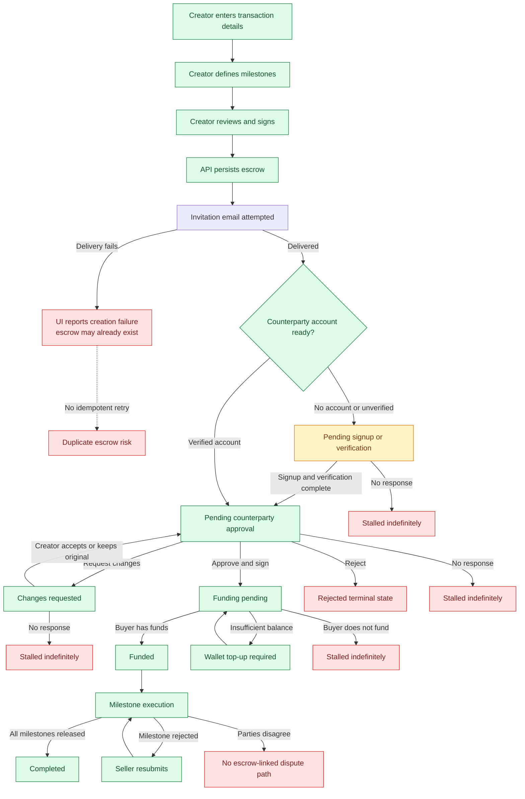
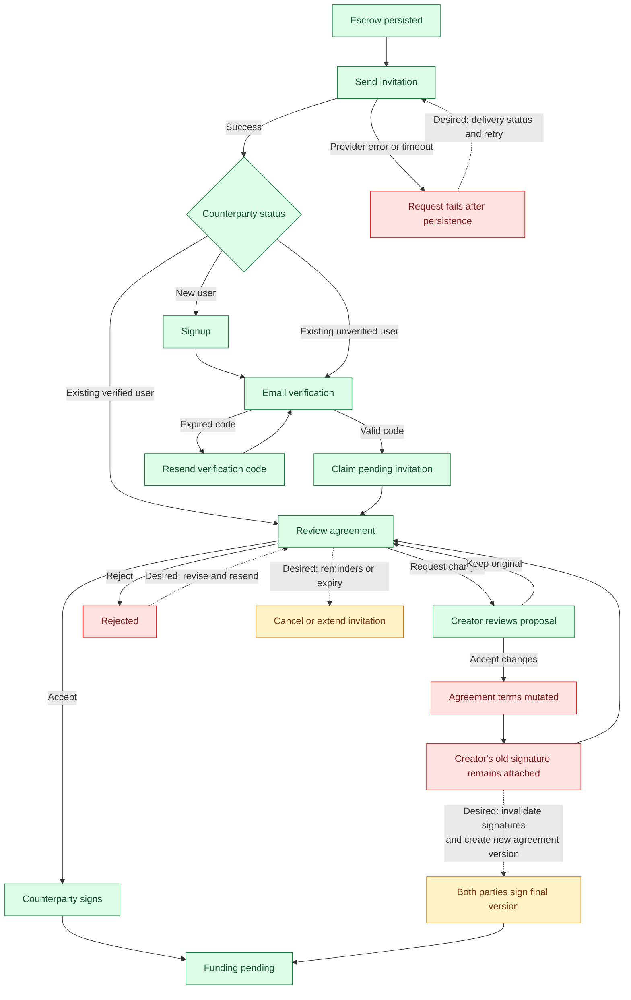
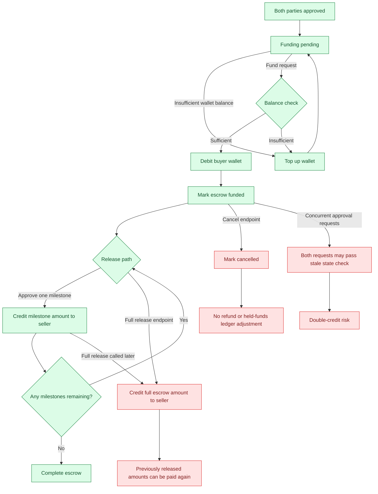
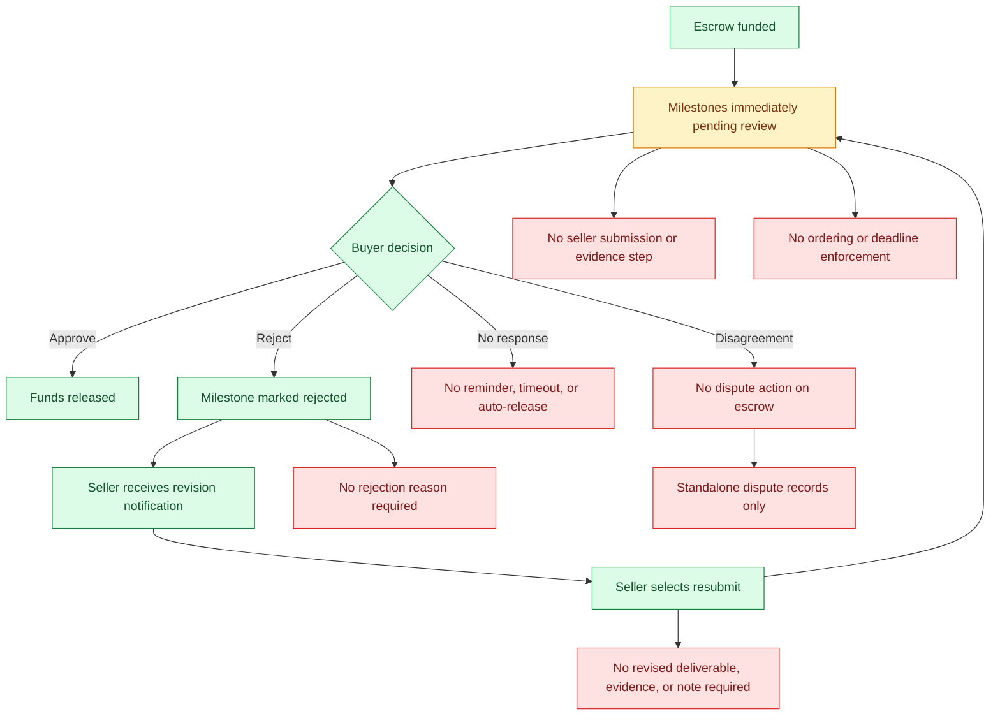
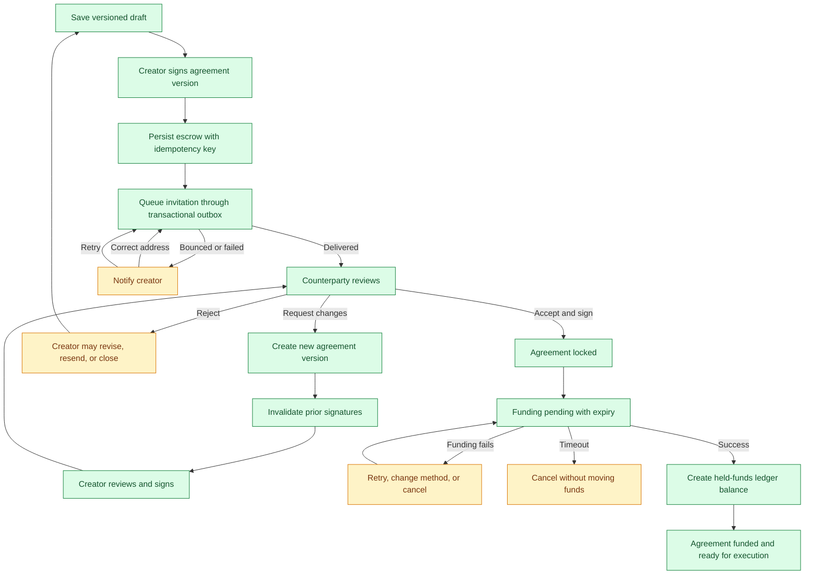
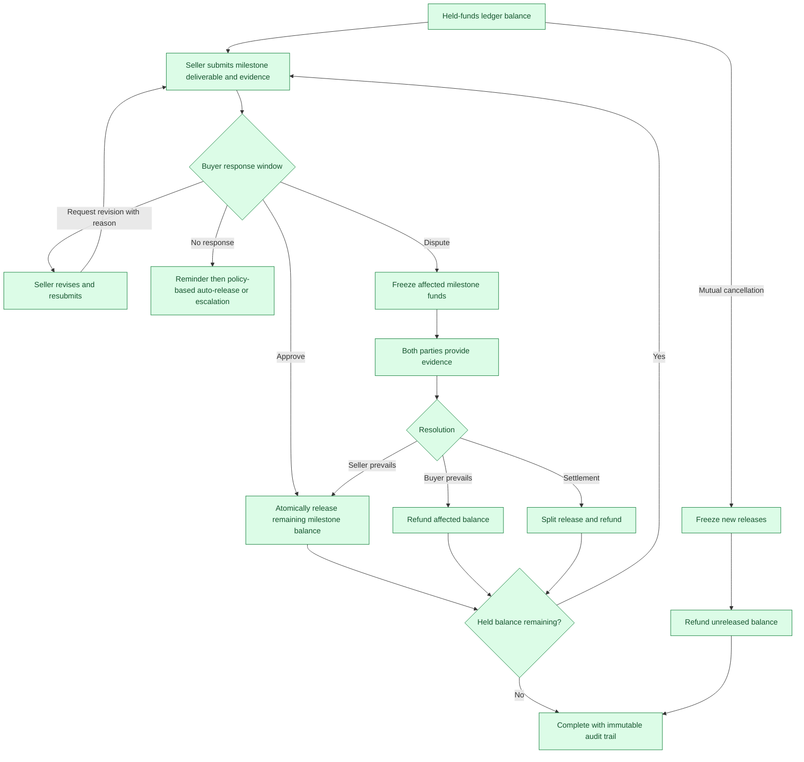

# MyEscrow unhappy workflow diagrams

These diagrams map the implemented escrow lifecycle, its current unhappy paths, and a target recovery model. They are intended to support product decisions, acceptance criteria, and implementation sequencing.

## Legend

- Green nodes are successful or safely recoverable outcomes.
- Amber nodes require user action or can become stalled.
- Red nodes are dead ends, integrity risks, or unsupported recovery paths.
- Dashed arrows represent recovery transitions that should exist but do not exist today.

## 1. Current end-to-end lifecycle

### Diagram summary

**Purpose**

This diagram shows the implemented journey from transaction creation through completion and makes every current stall or unsupported exit visible.

**Flow in plain language**

1. The creator enters the transaction, defines milestones, signs, and submits the escrow.
2. MyEscrow persists the escrow and attempts to invite the counterparty.
3. The counterparty completes onboarding if necessary, then approves, rejects, or requests changes.
4. After approval, the buyer funds the escrow and milestone execution begins.
5. Buyer approval releases milestones until the escrow is complete.

**Key observations**

- An invitation failure can be reported after the escrow already exists, creating duplicate-retry risk.
- Signup, approval, change review, funding, and milestone review can all stall indefinitely.
- Agreement rejection has no revise-and-resend recovery path.
- A disagreement during execution has no escrow-linked dispute route.

**Process implication**

Every non-terminal state needs an owner, response deadline, reminder policy, and explicit cancel or escalate transition. Creation also needs idempotency so a retry cannot create a second escrow.

## 2. Invitation, review, and agreement changes

### Diagram summary

**Purpose**

This diagram focuses on invitation delivery, counterparty onboarding, agreement negotiation, and whether signatures still represent the final terms.

**Flow in plain language**

1. The persisted escrow triggers an invitation to a new, unverified, or verified counterparty.
2. New and unverified users complete email verification before the escrow becomes available for review.
3. The counterparty can accept and sign, request changes, or reject the agreement.
4. Requested changes return to the creator, who can accept the proposal or retain the original terms.
5. Approval moves the escrow into funding pending.

**Key observations**

- Invitation delivery is outside the persistence transaction and has no tracked resend workflow.
- Rejection is terminal even though the intended business response is to revise or close the proposal.
- Accepted changes mutate the agreement while the creator's original signature remains attached.
- There is no invitation expiry or structured reminder cadence.

**Process implication**

Invitations should be delivered through a retryable outbox. Every material change should create a new agreement version, invalidate prior signatures, and require both parties to sign the exact version that will be funded.

## 3. Current funding and release integrity risks

### Diagram summary

**Purpose**

This diagram isolates the money-moving paths and highlights where the current implementation can lose, strand, or over-release escrow funds.

**Flow in plain language**

1. An approved escrow waits for the buyer to have sufficient wallet balance.
2. Funding debits the buyer and marks the escrow funded.
3. The buyer can release individual milestone amounts until all milestones are complete.
4. A separate full-release endpoint can also credit the full escrow amount.
5. Cancellation and concurrent approval requests form additional branches from the funded state.

**Key observations**

- Calling full release after one or more milestone releases can pay previously released funds again.
- Cancelling a funded escrow changes its status without refunding or reconciling held funds.
- Concurrent requests can pass checks made against the same stale state and double-credit the seller.
- The escrow has no authoritative held, released, and refundable balance ledger.

**Process implication**

Money movement must use one atomic ledger-backed release mechanism. Conditional database transitions and idempotency keys must guarantee that the total released plus refunded amount can never exceed the amount funded.

## 4. Current milestone rejection and dispute flow

### Diagram summary

**Purpose**

This diagram shows what happens after funding when work is reviewed, rejected, resubmitted, ignored, or disputed.

**Flow in plain language**

1. Funding immediately places milestones into a buyer-reviewable state.
2. The buyer can approve and release funds or reject the milestone.
3. Rejection notifies the seller, who can select resubmit and return the milestone to review.
4. No-response and disagreement branches do not lead to operational recovery.

**Key observations**

- The seller never explicitly submits a deliverable or supporting evidence.
- The buyer does not have to provide a rejection reason.
- Resubmission does not require revised work, evidence, or a response to the rejection.
- Deadlines and milestone ordering are informational rather than enforced.
- Existing dispute records are not connected to the escrow or affected funds.

**Process implication**

Milestones need explicit submission packages, response windows, reasoned revision requests, and evidence history. A dispute should freeze only the affected balance while leaving unrelated milestones governed by clear policy.

## 5. Target recoverable agreement and funding process

### Diagram summary

**Purpose**

This target diagram replaces the fragile creation-to-funding path with versioned consent, reliable delivery, recoverable failures, and an explicit held-funds balance.

**Flow in plain language**

1. The creator saves and signs a versioned agreement draft.
2. An idempotent create operation persists the escrow and queues the invitation transactionally.
3. Delivery failures notify the creator and allow address correction or retry.
4. Counterparty changes create a new agreement version and invalidate earlier signatures.
5. A fully signed version becomes locked before funding starts.
6. Funding can succeed, be retried, or expire safely without moving money.

**Key observations**

- Persistence and notification are separated without losing delivery accountability.
- Rejection becomes recoverable through revise, resend, or close choices.
- Both signatures always refer to one immutable agreement version.
- Funding success creates an auditable held-funds ledger rather than relying only on lifecycle status.

**Process implication**

This process establishes the prerequisites for safe execution: a single final agreement, traceable consent, retry-safe creation, and a precise balance that downstream releases and refunds must reconcile against.

## 6. Target recoverable milestone and dispute process

### Diagram summary

**Purpose**

This target diagram defines a recoverable post-funding workflow for evidence-based delivery, buyer review, disputes, settlement, refunds, and mutual cancellation.

**Flow in plain language**

1. The seller submits a milestone deliverable with evidence against the held balance.
2. The buyer approves, requests a reasoned revision, does not respond, or opens a dispute.
3. Approval releases only the remaining milestone balance atomically.
4. A dispute freezes the affected amount while both parties provide evidence.
5. Resolution releases, refunds, or splits the disputed balance.
6. Remaining funds continue to the next milestone; a zero balance completes the escrow.

**Key observations**

- No-response behavior becomes a defined policy rather than an indefinite stall.
- Disputes affect only the relevant milestone balance.
- Every resolution outcome reconciles against the held-funds ledger.
- Mutual cancellation freezes new releases and refunds only the unreleased balance.
- Completion produces an immutable audit trail of submissions, decisions, releases, and refunds.

**Process implication**

The execution model becomes a controlled balance-allocation process: every dollar leaves escrow exactly once through release, refund, or settlement, and every outcome has evidence and an accountable decision path.

## Recommended implementation order

1. Enforce held-balance invariants and eliminate competing full-release behavior.
2. Add atomic conditional transitions and idempotency for every money-moving action.
3. Version agreements and invalidate signatures after any material change.
4. Add explicit timeout, reminder, cancellation, and refund transitions.
5. Introduce seller submission evidence and buyer rejection reasons.
6. Link disputes to escrows and milestones, then freeze affected funds during resolution.
