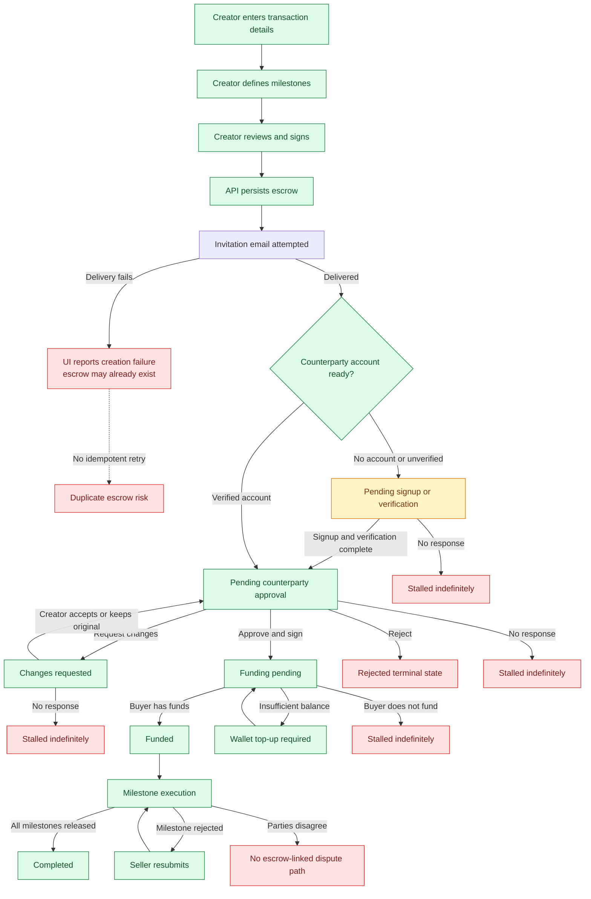
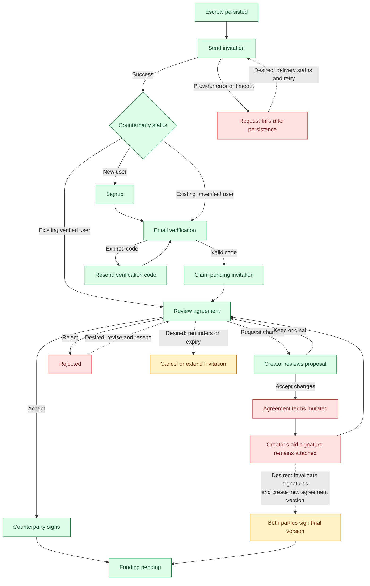
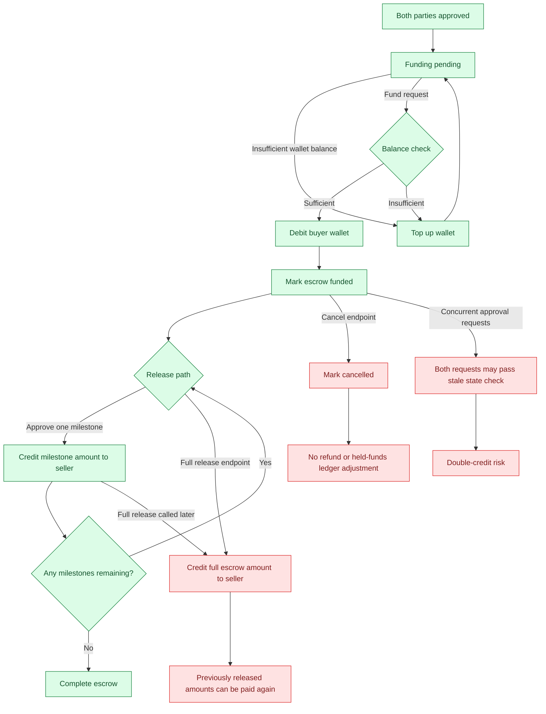
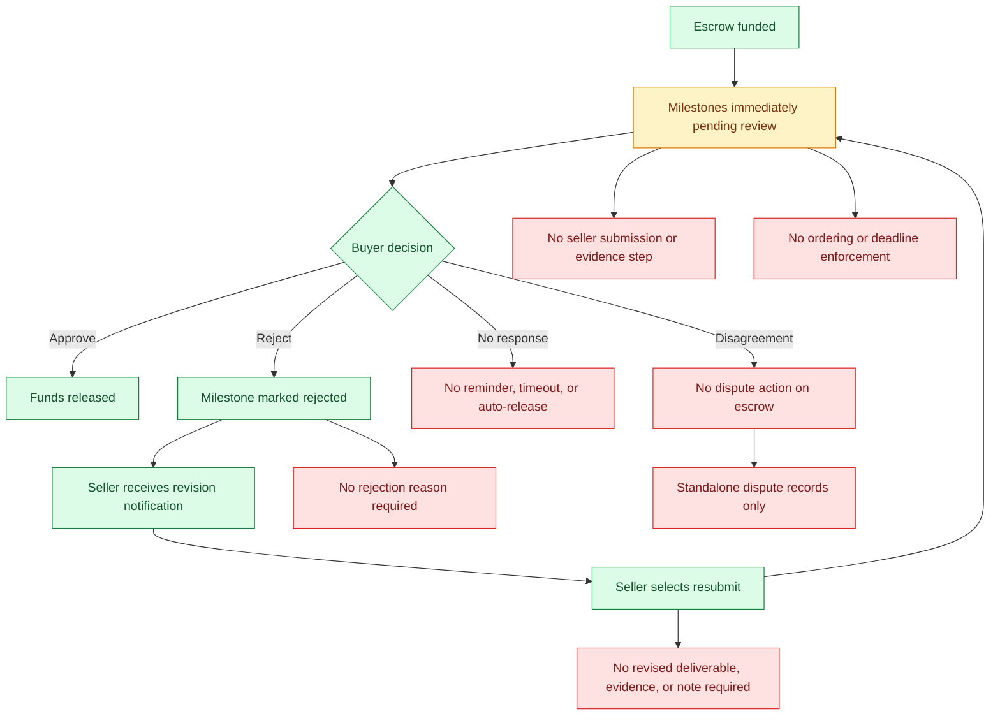
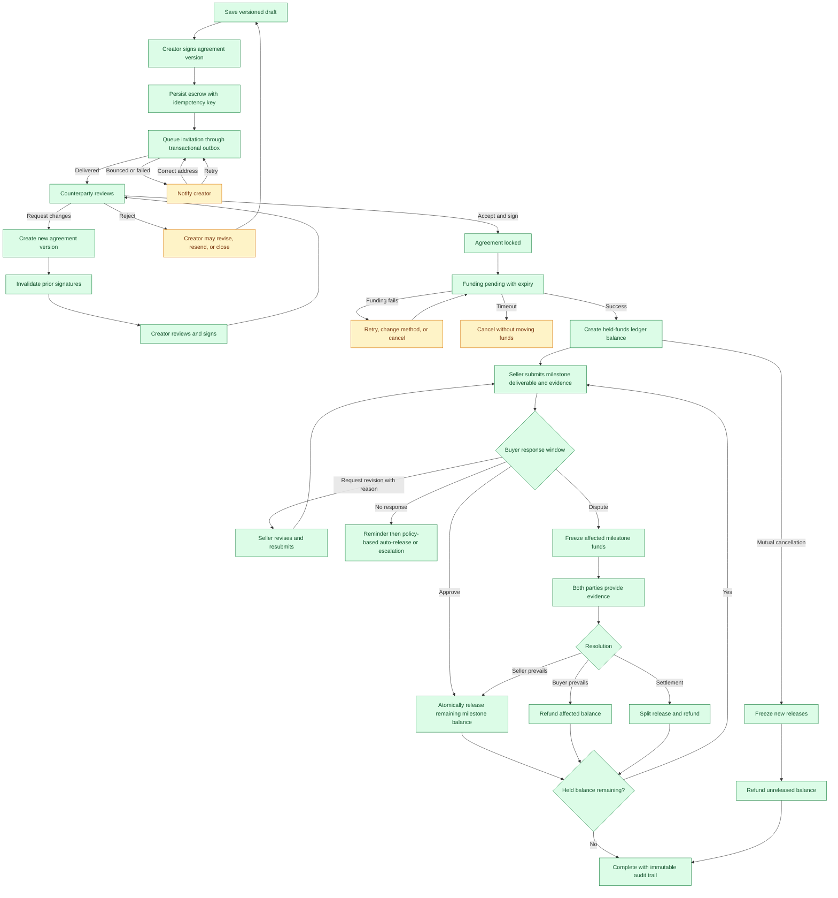

# MyEscrow unhappy workflow diagrams

These diagrams map the implemented escrow lifecycle, its current unhappy paths, and a target recovery model. They are intended to support product decisions, acceptance criteria, and implementation sequencing.

## Legend

- Green nodes are successful or safely recoverable outcomes.
- Amber nodes require user action or can become stalled.
- Red nodes are dead ends, integrity risks, or unsupported recovery paths.
- Dashed arrows represent recovery transitions that should exist but do not exist today.

## 1. Current end-to-end lifecycle

## 2. Invitation, review, and agreement changes

## 3. Current funding and release integrity risks

## 4. Current milestone rejection and dispute flow

## 5. Target recoverable escrow process

## Recommended implementation order

1. Enforce held-balance invariants and eliminate competing full-release behavior.
2. Add atomic conditional transitions and idempotency for every money-moving action.
3. Version agreements and invalidate signatures after any material change.
4. Add explicit timeout, reminder, cancellation, and refund transitions.
5. Introduce seller submission evidence and buyer rejection reasons.
6. Link disputes to escrows and milestones, then freeze affected funds during resolution.
